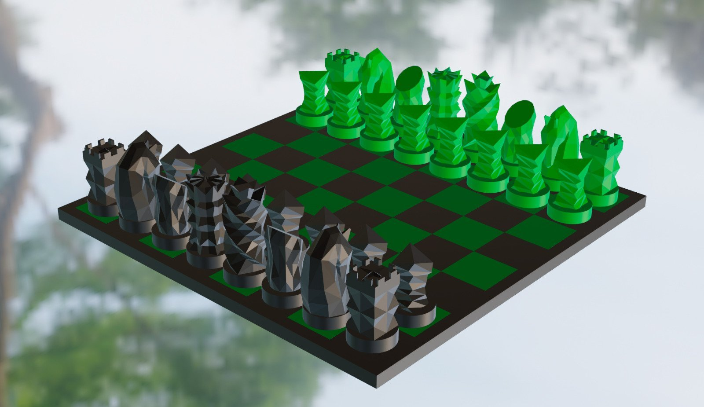
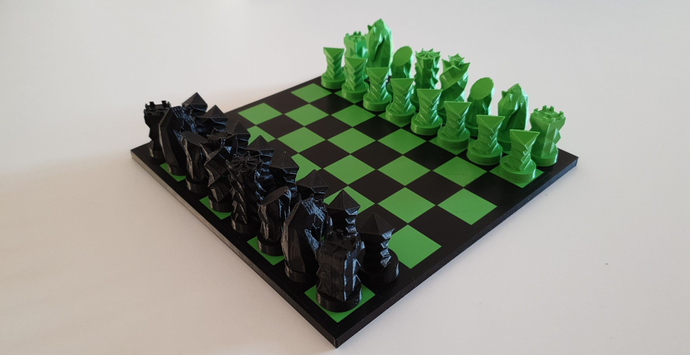
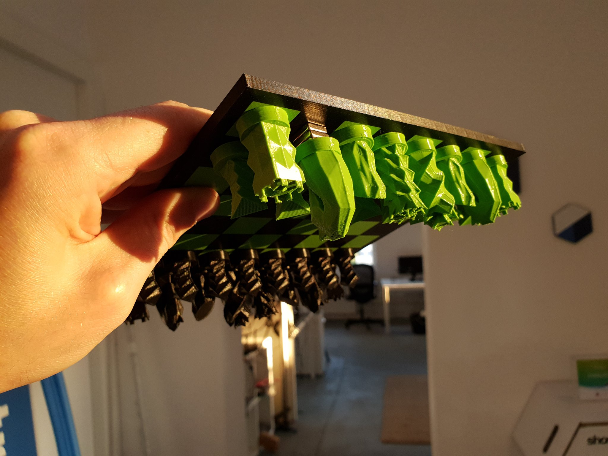

<h1>3D Printable Chess</h1>

<h2>Abstract</h2>
The goal of this project was to create a 3D printable, magnetic chess board. The art style was chosen to be quite abstract and somewhat futuristic ant to be printable on an Anycubic I3 Mega 3D printer without additional support material.

<h2>Pictures</h2>
<h3>Rendering</h3>

<h3>Actual Picture</h3>

<h3>Magnets in Action</h3>

<h2>Print Instructions</h2>
The print is a little more complicated than usual. Here are some pointers on how to get it working with cura. Note that the chess boar is printed upside down, which means the surface to play on will be directly printed onto the print bed!
Also, the files with the different steps are provided in a 2x2 configuration. This is much easier for testing without wasting lots of filament and time.

* Buy magnets. You will need at least 96 magnets with the size 10mm x 10mm x 3mm.
* Test if all the magnets are equally strong. I bought 100 magnets and 1 was super weak which I had to replace after the print was finished :-(
* If you use cura, install the plugin "Z Offset Setting". It is available through the "in Cura" market place.
* The files print great with 0.2 mm layer height.
* I used PLA with pretty much standard settings
* All the files are printed without support!
* The offset in the filename is the number of layers that need to be offsetted. This means if you print with 0.2 mm layer height, offset 1 = 0.2 mm z offset in your slicer.
* Slice all the files beforehand, and have them ready on your SD card.
* For the step 5 files and the pieces, you need to add a pause during the print. In Cura, this can be done by selecting "Extensions" -> "Post Processing" -> "Modify G-Code". Then click on "Add a script" and for the Anycubic I3 Mega select "Pause at height". Then select "Pause at": "Layer No.". Enter the last layer before the slicer starts bridging over the holes for the magnets. "Park Print Head" at 10 & 10 to avoid the printhead crashing into the board. I selected the print temperature as the "Standby Temperature". 
* Also for the Anycubic I3 Mega, this pause command seems bugged. You need to open the exported gcode with a text editor and search for the line "M0 ; Do the actual pause" and replace that line with the instructions shown in [drucktipps3d PDF on Page 8](https://drucktipps3d.de/wp-content/uploads/asgarosforum/22204/Filamentwechsel-Pause-At-Height-Version2-Anycubic-8bit-Board-.pdf). Otherwise, the print will not resume after you inserted the magnets. These lines will play a melody and give you 30 seconds to send the pause command to the printer from which your I3 Mega can resume from.
* Cleaning your print surface as good as you can. All remains will be visible in the print surface! I have great results with 99.9% Isopropanol.
* Start printing with the Step 1.
* As soon as the print finishes, select "Preheat" again on your printer to avoid part cooling and loosing bed adhesion.
* Change material and continue with step 2. Select preheat as soon as the step finishes.
* Repeat until done.
* If you used the Cura Anycubic I3 Mega Pause hack, make sure to hear your printer playing the Indiana Jones Theme. You only have 30 seconds to press pause on the touchscreen or the print will continue by itself.
* Some of my magnets had a loose fit. I used some two sided tape to make sure they stayed put until they were overprinted.
* Let the chess board cool completely. The board will come off much easier after it cooled down completely.
* If you have issues with warping parts, you can try printing in a box to avoid temperature differences.
